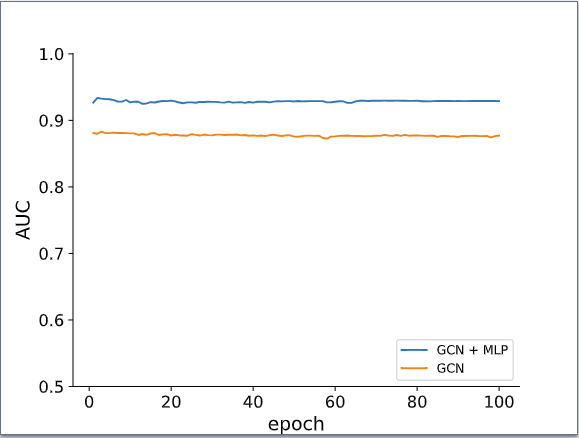
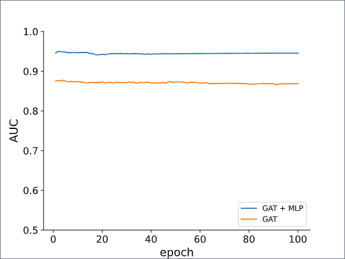
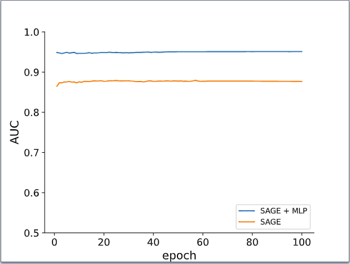
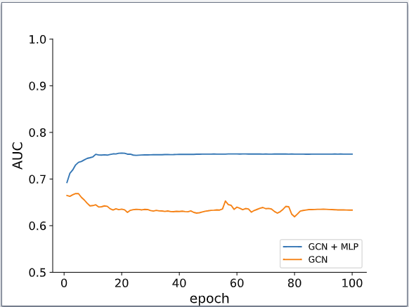
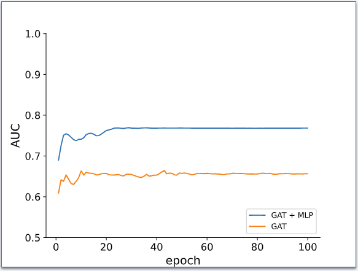
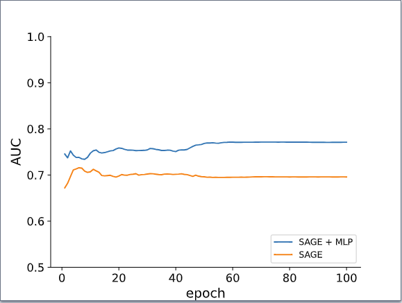

<!DOCTYPE html>
<html lang="en">
<head>
  <meta charset="UTF-8">
  
</head>
<body>
  <h1>Enhancing Graph Neural Networks with Edge Features</h1>

  
In this section, we study the integration of edge features to enhance the performance of Graph Convolutional Networks (GCN), Graph Attention Networks (GAT), and GraphSAGE (SAGE) models. The conventional approach without incorporating edge features follows the standard procedure. Initially, employing one of the GNN models mentioned (GCN, GAT, or SAGE), node embeddings denoted as $h_v$, are generated over the training set using the node features available in the dataset. Next, within the predictor, for each edge $(u,v)$, the element-wise multiplication $h_u \cdot h_v=(h_u^1 \cdot h_v^1,h_u^2 \cdot h_v^2,...,h_u^N \cdot h_v^N)$ is computed, where $h_u^i$ and $h_v^i$ represent the $i-th$ element of node embeddings $h_u$ and $h_v$ respectively. This resultant edge representation is then passed through a 3-layer Multi-Layer Perceptron (MLP) to obtain the final edge prediction.

  
In contrast, our proposed model, <i>PROXI-GNN</i>, we introduce a novel approach by incorporating the edge features proposed in our study directly into the prediction process. Specifically, within the predictor, our model takes the edge features of edge $(u,v)$ and processes them through a 3-layer MLP to extract meaningful representations. These MLP layers help in capturing intricate patterns and characteristics present in the edge features. Following this, the resulting edge embedding from the MLP layers is concatenated with the element-wise product $h_u \cdot h_v$ obtained earlier, and then it is passed through 3-layer MLP as above. This concatenation operation combines the learned edge features with the node embeddings, creating a fused representation that captures both node-level and edge-level information. Our methodology seeks to utilize the extra information included in the relationships between nodes, as encoded in the edge features, by integrating the edge features in this way. With both node and edge information included, this enhanced representation offers a more complete picture of the network structure, which could enhance prediction performance. Our model's ability to accurately forecast the existence or attributes of edges is improved by incorporating edge features directly into the prediction process. This helps the model to better capture the intricate interconnections and dependencies inside the graph. 

  
 In Figure 1, we present a comparative analysis between the standard algorithm, GNN, and our proposed modified algorithm, PROXI-GNN, on the Cora dataset, employing the before mentioned GNN models. The visualization illustrates the performance comparison across different GNN models, highlighting the impact of integrating our edge feature vectors into the models.   

    
    
    

    <b>Figure 1: Homophilic Setting.</b> Performance comparison of three GNN models (GCN, SAGE, GAT) using the original algorithm (orange) and integrating PROXI vectors via MLP (blue) with the same hyperparameters on CORA dataset.

  

 From the depicted results, it is evident that incorporating our edge feature vectors yields notable improvements in performance across all GNN models examined. Specifically, our modified algorithm PROXI-GNN consistently outperforms the standard algorithm by a margin of at least $5\%$ in terms of predictive accuracy. This substantial enhancement underscores the significance of integrating edge feature information into the modeling process. Same improvement can be noticed for heterophilic dataset Texas in Figure 2, where the AUC is considerably improved by $8\%$. 

    
    
    

    <b>Figure 2: Heterophilic Setting.</b> Performance comparison of three GNN models (GCN, SAGE, GAT) using the original algorithm (orange) and integrating PROXI vectors via MLP (blue) the same hyperparameters on TEXAS dataset.

  
 

 The observed improvements in performance serve as compelling evidence of the efficacy of our proposed approach. By leveraging the additional contextual information embedded in the edge features, our modified algorithm effectively enhances the models' ability to capture intricate relationships and dependencies within the graph structure. This enhancement ultimately leads to more accurate and robust predictions, as demonstrated by the substantial performance gains across the GNN models evaluated. 

 Overall, the outcomes shown in Figures 1 and 2 highlight the significance and effectiveness of the modifications  we suggested. The noteworthy enhancements in performance that may be obtained by using our proposed edge feature vectors underscore the possibility of our methodology to augment the predictive powers of GNN models, especially in situations where edge-level data is pivotal to the underlying graph structure. 

 In Table 1, we present a performance comparison of GNN models with PROXI-GNN on two distinct datasets, CORA (homophilic) and TEXAS (heterophilic). Notably, the inclusion of our edge features demonstrates significant improvements in classification AUC, i.e., <b>up to 8% in CORA, and 11% in TEXAS.</b> This substantial increase in AUC suggests that the incorporation of our edge features enhances the model's ability to learn from graph structures. Similar results are observed on the heterophilic dataset TEXAS. These results underscore the importance of considering meaningful edge features in graph-based learning tasks, showcasing the efficacy of our PROXI method in improving GNN performance. 

  
  

  <table>
    <caption> <b>Table 1: </b>Performance comparison of GNN models on different datasets</caption>
    <thead>
      <tr>
        <th>Dataset</th>
        <th>Backbone</th>
        <th>GNN</th>
        <th>PROXI-GNN</th>
      </tr>
    </thead>
    <tbody>
      <tr>
        <td rowspan="3"><b>CORA</b></td>
        <td>GCN</td>
        <td>$87.71 \pm 2.06$</td>
        <td>$92.90 \pm 0.92$</td>
      </tr>
      <tr>
        <td>GAT</td>
        <td>$86.86 \pm 1.78$</td>
        <td>$94.56 \pm 0.87$</td>
      </tr>
      <tr>
        <td>SAGE</td>
        <td>$87.67 \pm 1.95$</td>
        <td>$95.11 \pm 1.32$</td>
      </tr>
      <tr>
        <td rowspan="3"><b>TEXAS</b></td>
        <td>GCN</td>
        <td>$63.34 \pm 5.63$</td>
        <td>$75.35 \pm 4.97$</td>
      </tr>
      <tr>
        <td>GAT</td>
        <td>$65.65 \pm 3.75$</td>
        <td>$76.84 \pm 4.52$</td>
      </tr>
      <tr>
        <td>SAGE</td>
        <td>$69.58 \pm 7.14$</td>
        <td>$77.10 \pm 4.26$</td>
      </tr>
    </tbody>
  </table>
</body>
</html>
